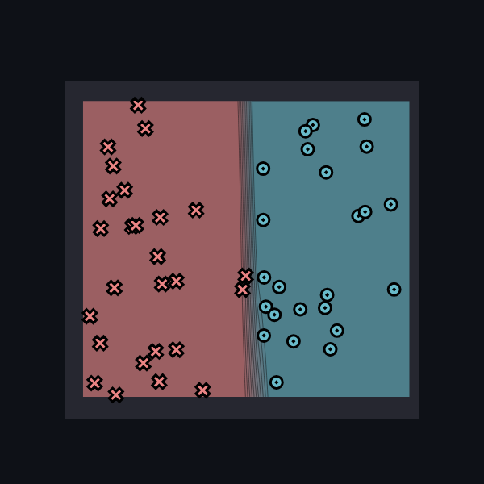
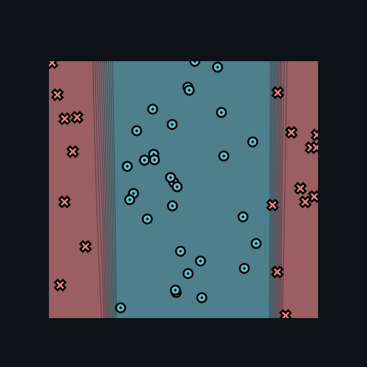
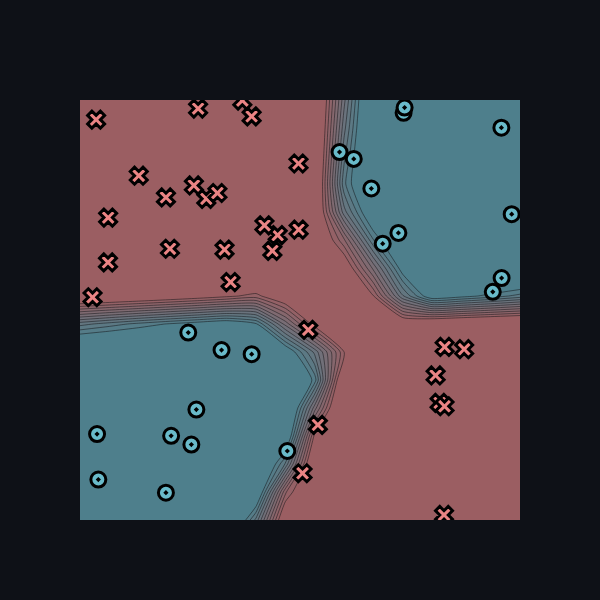

[](https://classroom.github.com/online_ide?assignment_repo_id=15889441&assignment_repo_type=AssignmentRepo)
# MiniTorch Module 1


* Docs: https://minitorch.github.io/

* Overview: https://minitorch.github.io/module1/module1/

This assignment requires the following files from the previous assignments. You can get these by running

```bash
python sync_previous_module.py previous-module-dir current-module-dir
```

The files that will be synced are:

        minitorch/operators.py minitorch/module.py tests/test_module.py tests/test_operators.py project/run_manual.py

# Task 1.5

## Results (Image)

### Simple

Hyperparameters:
- Hidden: 2
- Rate: 0.5
- Epochs: 500
- Data points: 50



### Diag

Hyperparameters:
- Hidden: 4
- Rate: 0.5
- Epochs: 500
- Data points: 50


### Split

Hyperparameters:
- Hidden: 5
- Rate: 0.5
- Epochs: 500
- Data points: 50



### Xor

Hyperparameters:
- Hidden: 10
- Rate: 0.5
- Epochs: 500
- Data points: 50



## Results (Loss Log)
### Simple

| Epoch | Loss | Correct |
|-------|------|---------|
0/500|0|0
10/500|34.936676423419634|26
20/500|34.639830226700376|26
30/500|34.618823266063224|26
40/500|34.61735793220703|26
50/500|34.61725597456524|26
60/500|34.617248884414195|26
70/500|34.617248391434885|26
80/500|34.61724835715921|26
90/500|34.61724835477614|26
100/500|34.61724835461043|26
110/500|34.61724835459896|26
120/500|34.61724835459812|26
130/500|34.61724835459805|26
140/500|34.61724835459805|26
150/500|34.61724835459807|26
160/500|34.61724835459809|26
170/500|34.61724835459809|26
180/500|34.61724835459808|26
190/500|34.617248354598075|26
200/500|34.61724835459808|26
210/500|34.61724835459807|26
220/500|34.617248354598075|26
230/500|34.61724835459805|26
240/500|34.61724835459806|26
250/500|34.61724835459807|26
260/500|34.617248354598075|26
270/500|34.617248354598075|26
280/500|34.617248354598075|26
290/500|34.617248354598075|26
300/500|34.617248354598075|26
310/500|34.617248354598075|26
320/500|34.617248354598075|26
330/500|34.617248354598075|26
340/500|34.617248354598075|26
350/500|34.617248354598075|26
360/500|34.617248354598075|26
370/500|34.617248354598075|26
380/500|34.617248354598075|26
390/500|34.617248354598075|26
400/500|34.617248354598075|26
410/500|34.617248354598075|26
420/500|34.617248354598075|26
430/500|34.617248354598075|26
440/500|34.617248354598075|26
450/500|34.617248354598075|26
460/500|34.617248354598075|26
470/500|34.617248354598075|26
480/500|34.617248354598075|26
490/500|34.617248354598075|26
500/500|34.617248354598075|26
10/500|34.61185168442485|26
20/500|30.347670240719108|26
30/500|22.832966905728284|44
40/500|14.994555765406924|50
50/500|10.477088495528859|48
60/500|8.237602030515013|50
70/500|6.80411361623834|50
80/500|5.8945458493607505|50
90/500|5.282191540879311|50
100/500|4.829917265272677|50
110/500|4.501051526461071|50
120/500|4.255711829092311|50
130/500|4.55372337926906|50
140/500|4.310112005949865|50
150/500|4.007437656294793|50
160/500|3.889493203121038|50
170/500|3.7449389368718267|50
180/500|3.6103109839745566|50
190/500|3.505123260846862|50
200/500|3.396852131608779|50
210/500|3.300372777482005|50
220/500|3.215901504346674|50
230/500|3.1351319272630582|50
240/500|3.0570388815666507|50
250/500|2.9883242419832485|50
260/500|2.9224670295401234|50
270/500|2.8597311102562277|50
280/500|2.800849924475694|50
290/500|2.7449106594376027|50
300/500|2.6908211527623727|50
310/500|2.6395375120870206|50
320/500|2.590259503437159|50
330/500|2.5429327185880486|50
340/500|2.497219532411213|50
350/500|2.45298401909505|50
360/500|2.4100580614895497|50
370/500|2.368284081319856|50
380/500|2.3275122892863345|50
390/500|2.2875952260369834|50
400/500|2.248613956967982|50
410/500|2.210248182739744|50
420/500|2.172312679554577|50
430/500|2.1345595785138087|50
440/500|2.097349220870472|50
450/500|2.0598413678841827|50
460/500|2.02155613008645|50
470/500|1.9811085254236673|50
480/500|1.9408975155919146|50
490/500|1.8974092362003292|50
500/500|1.845794184001497|50

### Diag

| Epoch | Loss | Correct |
|-------|------|---------|
0/500|0|0
10/500|18.19642995233847|45
20/500|15.934676970734674|45
30/500|14.98444018489821|45
40/500|13.91586939666953|45
50/500|12.243981577433289|45
60/500|10.217971271704272|45
70/500|8.256225658993007|48
80/500|6.739642147669352|49
90/500|5.601280637307|50
100/500|4.792263231854795|50
110/500|4.199051548937682|50
120/500|3.7371302013284993|50
130/500|3.389214690952903|49
140/500|3.106713806202299|49
150/500|2.8800695681422646|49
160/500|2.691803360572632|49
170/500|2.531926680797818|49
180/500|2.393246970180034|50
190/500|2.272541793395764|50
200/500|2.1652048406429154|50
210/500|2.068378748406386|50
220/500|1.9810302989469228|50
230/500|1.9025296602368535|50
240/500|1.8296399438394741|50
250/500|1.76125848313786|50
260/500|1.6967894637857102|50
270/500|1.6357605676459424|50
280/500|1.5777897080103624|50
290/500|1.523705617458091|50
300/500|1.4725981350697093|50
310/500|1.4238644286389073|50
320/500|1.3769648529891754|50
330/500|1.3317968900648585|50
340/500|1.288275375966529|50
350/500|1.2463284789125593|50
360/500|1.2058945134101269|50
370/500|1.1669192988894925|50
380/500|1.1293543288045387|50
390/500|1.0931551039657985|50
400/500|1.0582800390275198|50
410/500|1.0246895692242386|50
420/500|0.9923455095355308|50
430/500|0.9612099544583956|50
440/500|0.9312473460763767|50
450/500|0.902420310565899|50
460/500|0.8746936700735239|50
470/500|0.8480307710493408|50
480/500|0.8223964042472687|50
490/500|0.7977552090057674|50
500/500|0.774072140182394|50

### Split

| Epoch | Loss | Correct |
|-------|------|---------|
0/500|0|0
10/500|32.719472883090994|31
20/500|32.401933654336936|31
30/500|32.189622150802094|31
40/500|31.955102885885317|36
50/500|31.522237363653975|36
60/500|29.924149730321027|39
70/500|27.90081595107956|39
80/500|25.46023756155376|41
90/500|23.413727833719594|39
100/500|22.13308241119901|38
110/500|22.41884082249903|35
120/500|22.590807670744365|38
130/500|17.114072326593373|45
140/500|23.139075678025325|42
150/500|23.479579350319472|42
160/500|17.518518372291464|44
170/500|17.307884390843203|45
180/500|12.992680157967191|46
190/500|12.917772592856586|46
200/500|10.838367324571854|46
210/500|10.02734568959766|46
220/500|10.836511427704016|46
230/500|7.364857045993678|46
240/500|7.5818444390361|46
250/500|7.746870174355532|46
260/500|6.647717981383023|46
270/500|5.485923080650289|47
280/500|4.9953364711812664|48
290/500|5.27847411946396|48
300/500|5.959814270202085|47
310/500|5.477572668482076|48
320/500|2.954833110522032|48
330/500|1.488037847741537|50
340/500|1.325405025897893|50
350/500|1.222301767902725|50
360/500|1.1347336845988263|50
370/500|1.0580652647943027|50
380/500|0.9901857429895122|50
390/500|0.9295779221384202|50
400/500|0.8750972139172374|50
410/500|0.8259370957523104|50
420/500|0.7813221444542304|50
430/500|0.740612117188886|50
440/500|0.7033337151783156|50
450/500|0.6690887825110801|50
460/500|0.6375391121258202|50
470/500|0.6083950698515886|50
480/500|0.5814068686633258|50
490/500|0.5563577583066966|50
500/500|0.533058648745822|50

### XOR

| Epoch | Loss | Correct |
|-------|------|---------|
0/500|0|0
10/500|31.892704402720423|26
20/500|41.463346399549806|22
30/500|31.04469640645289|32
40/500|34.02576200040473|32
50/500|31.930330806202942|34
60/500|30.326084412296787|36
70/500|30.760402321706543|34
80/500|32.18975323188477|34
90/500|28.76997863436332|35
100/500|23.928803695280088|41
110/500|23.38768876638471|42
120/500|26.868490362803374|37
130/500|21.15443568067535|42
140/500|26.077889533725145|37
150/500|22.312740491675886|38
160/500|21.246452089408407|39
170/500|21.053612287929774|39
180/500|20.19667458606329|40
190/500|19.324025678422625|42
200/500|19.253006762738853|41
210/500|18.619253550149512|42
220/500|18.28090976205253|42
230/500|18.10973011914012|41
240/500|17.100993488135224|42
250/500|17.281157166835808|41
260/500|16.63599778915463|41
270/500|15.820377205054003|43
280/500|15.535197544043392|42
290/500|14.499444142686892|43
300/500|14.086737133664627|43
310/500|13.692357873912561|43
320/500|12.81404367009069|44
330/500|11.949073401625935|44
340/500|10.431719653974284|46
350/500|10.915634176841051|46
360/500|7.545728223484688|47
370/500|14.1028196677457|42
380/500|5.748704258079873|49
390/500|5.592087011785772|48
400/500|16.63229236318137|42
410/500|4.656814379233402|49
420/500|4.70910922528526|48
430/500|14.835249483208635|42
440/500|3.919409824471215|50
450/500|3.096325553020459|50
460/500|3.180978142521721|50
470/500|5.477370809453243|47
480/500|6.462765491728719|46
490/500|2.3078216859738903|50
500/500|2.145184440873333|50